## Этап 1. Исследовательский анализ (EDA)

### Анализ качества данных 

- проверка на парность прошла успешно, для всех Images есть labels(masks)
- пустых масок не найдено
- размеры картинок и масок совпадают
- в train найдены 5 картинок, где фон составляет > 99.5%, визуальная проверка показала, что картинки не размечены корректно, были удалены (000000028253_7169.png, 000000121530_5761.png,000000247301_4455.png, 000000275919_4499.png, 000000574769_0.png)
- после визуальной оценки всего train ds - были удалены (из-за некорректнрой разметки) 3 сэмпла (000000023731_404, 000000419618_7033, 000000481212_908)

### EDA
- потенциальных классов (включая фон): 3 (background, cat, dog)
- распределение классов bg/cat/dog ~ 90/5.5/4.5, Во всех трех сплитах пропорции классов практически идентичны. 
- при обучении имеет смысл рассмотреть class_weight - [0.37, 3.28, 3.92]

- создан и визуализирован dataset

- mmsegmentation/mmseg/datasets/pr_dataset.py 
- practicum_work/src/data/check_dataset.py 
- notebook.ipynb

## Этап 2. Формирование первичных гипотез

### Стартовая гипотеза 1 

**Описание гипотезы**  

Для задачи сегментации (3 класса: фон, кот, собака) на таком маленьком датасете (190 изображений) предобученная модель PSPNet — это хорошая отправная точка, но текущий конфиг требует адаптации.
Ниже представлены две первичные гипотезы для создания сильного бейзлайна.

------------------------------
## Гипотеза 1: Консервативный бейзлайн (Минимум изменений)
Используем исходную архитектуру, но адаптируем её под малый размер изображений и данных, чтобы избежать моментального переобучения.

* Модель: pspnet_r50-d8(pspnet_r50-d8_512x1024_40k_cityscapes_20200605_003338-2966598c.pth). Архитектуру не меняем, но меняем количество классов в num_classes с 19 на 3. Обязательно загружаем предобученные веса (ImageNet/Cityscapes) для энкодера (ResNet-50).
* Оптимизатор и LR: SGD с импульсом 0.9 и weight_decay=0.0005. Начальный lr=0.001 (уменьшен в 10 раз от дефолтного, так как датасет крошечный). Политика изменения LR: PolyLR.
* Лосс-функция: CrossEntropy и DiceLoss . Добавляем веса классов class_weight - [0.37, 3.28, 3.92]
* Длительность обучения: 300 эпох. 
* Аугментации: Минимальный базовый набор, чтобы не перегрузить модель.
    * Resize (короткая сторона 256, с сохранением пропорций)
    * RandomCrop (размер 256x256)
    * RandomFlip (горизонтальный, вероятность 0.5)
    * PhotoMetricDistortion (случайное изменение яркости, контраста, насыщенности)
    * Normalize и Pad

- до обучения mDice: 19.5800 

**Результаты обучения**  

- .\configs\_base_\datasets\pr_dataset.py
- .\configs\_base_\schedules\pr_schedule.py
- .\configs\pspnet_pr\pspnet_py.py
- ссылка на clearml  - сайт ClearML не открывается, будем строить график с помощью python tools/analysis_tools/analyze_logs.py work_dirs/pspnet_py/20260724_132610/vis_data/20260724_132610.json --keys mDice --out work_dirs/pspnet_py/out.png

- Best mDice: 81.97 (at iteration 240)
- примеры инференса (python tools/test.py configs/pspnet_pr/pspnet_py.py work_dirs/pspnet_py/epoch_240.pth --work-dir work_dirs/pspnet_py --out work_dirs/pspnet_py/raw)

------------------------------

## Гипотеза 2: Легковесный Dropout-регуляризатор (Защита от переобучения)
Цель этой гипотезы — агрессивно подавить оверфиттинг за счет сильной регуляризации, аугментаций и деструкции мелких признаков, заставив модель искать общие силуэты кошек и собак.
## Основные параметры конфигурации
* Модель: pspnet_r50-d8. Архитектуру не меняем, но меняем количество классов в num_classes с 19 на 3. Обязательно загружаем предобученные веса (ImageNet/Cityscapes) для энкодера (ResNet-50). Главное изменение — добавление или увеличение dropout_ratio в декодере (decode_head и auxiliary_head) до 0.5 (вместо стандартных 0.1). Это заставит сеть использовать разные каналы признаков.

* Оптимизатор и LR: Переход на AdamW. Он лучше штрафует веса (weight decay) в тяжелых моделях на малых данных. Начальный lr=0.0003 (стандарт для AdamW). Политика: CosineAnnealingLR с коротким линейным разогревом (LinearWarmup) на первых 5 эпохах. Это предотвратит разрушение предобученных весов на старте.
* Лосс-функция: CrossEntropy и DiceLoss . Добавляем веса классов class_weight - [0.37, 3.28, 3.92]
* Добавлен pool_scales=(2, 4, 8, 12) для адаптации под низкое разрешение и выделение локальных признаков вместо глобального фона
* Длительность обучения: 300 эпох. 
* Продвинутые аугментации: Направлены на разрушение текстурного контекста, чтобы модель учила форму животных, а не конкретный фон или шерсть.
    * RandomResize (масштабирование в диапазоне длинных сторон 0.5–1.5 от 256)
   * RandomCrop (размер 256x256, с заполнением пустых краев фоновым индексом)
   * RandomFlip (горизонтальный и вертикальный, если ракурсы съемки разнообразны)
   * Albu (интеграция библиотеки Albumentations): добавляем сильный GaussNoise (шум) или Blur (размытие), а также RandomBrightnessContrast.
   * CoarseDropout / CutOut (внутри Albu): затирание случайных прямоугольных областей на картинке черным цветом. Модель научится распознавать кошку, даже если видна только голова или хвост.

**Результаты обучения**  

- .\configs\_base_\datasets\pr_dataset_v2.py
- .\configs\_base_\schedules\pr_schedule_v2.py
- .\configs\pspnet_pr\pspnet_py_v2.py
- ссылка на clearml  - сайт ClearML не открывается, будем строить график с помощью python tools/analysis_tools/analyze_logs.py work_dirs/pspnet_py/20260724_132610/vis_data/20260724_132610.json --keys mDice --out work_dirs/pspnet_py/out.png

- Best mDice: 78.43 (at iteration 144)
- примеры инференса

## Этап 3. Эксперименты по улучшению качества

### Эксперимент 1 

**Описание эксперимента**

* На основе Гипотезы 1
* Меняем веса лосов, больще смещаем в сторону decode_head, было -  decode_head(CE (1.0) + Dice (2.0) = 3.0), auxiliary_head(CE (0.4) + Dice (2.0) = 2.4), делаем dh(1+1) и ah(0.4+0.4)
* Добавим RandomRotate
 
**Результаты обучения**

- configs\pspnet_pr\pspnet_py_exp.py
- configs\_base_\datasets\pr_dataset_exp.py
- configs\_base_\schedules\pr_schedule.py
- Best mDice: 80.53 (at iteration 225)

  

### Эксперимент 2 
* На основе Гипотезы 2
* Единственное изменение - убрать pool_scales=(2, 4, 8, 12), чтобы проверить его позитивное или негативное влияение

- .\configs\_base_\datasets\pr_dataset_v2.py
- .\configs\_base_\schedules\pr_schedule_v2.py
- .\configs\pspnet_pr\pspnet_py_v2_exp.py
- Best mDice: 79.73 (at iteration 213)

## Этап 4. Заключение и выбор лучшего эксперимента

| Столбец 0 | Столбец 1 | Столбец 2 | Столбец 3 | Столбец 4 |
| :---: | :---: | :---: | :---: | :---: |
| **gt** | 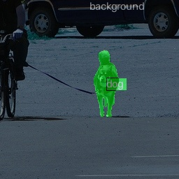 | 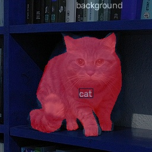 | 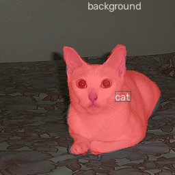 | 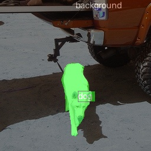 |
| **pretrained** | 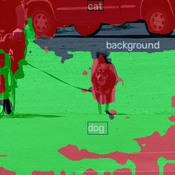 | 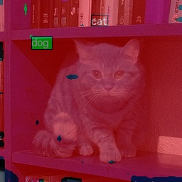 | 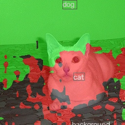 | 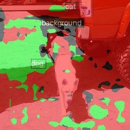 |
| **1 гипотеза** |  | 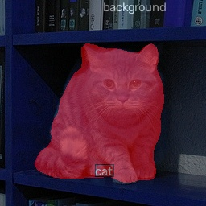 | 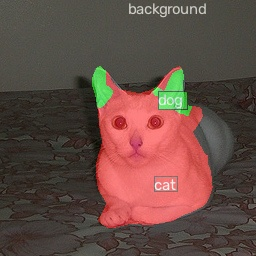 | 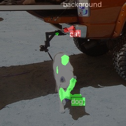 |
| **2 гипотеза** | 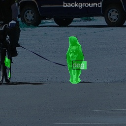 | 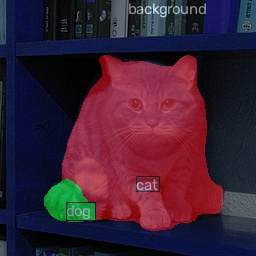 | 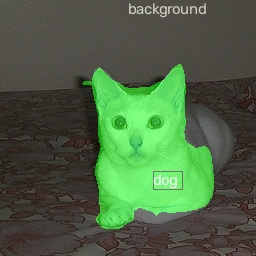 | 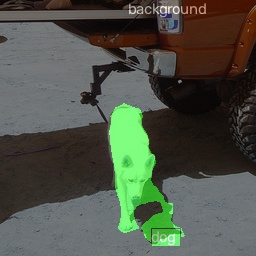 |
| **1 гипотеза +эксп** | 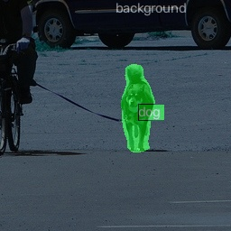 |  | 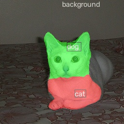 | 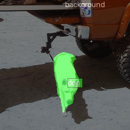 |
| **2 гипотеза +эксп** | 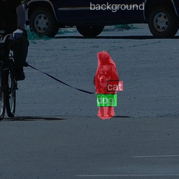 | 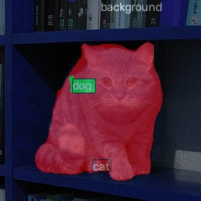 | 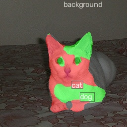 | 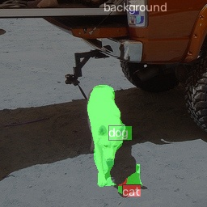 |

### Лучший эксперимент 

Кратко опишите параметры этого эксперимента и как вы пришли к нему.

**mDice (test subset) = ваше_значение**

### Примеры корректных предсказаний (тестовый датасет)

Приложите 3-5 картинок

### Примеры ошибок (тестовый датасет)

Приложите 3-5 картинок

### Возможности для улучшения 

Проанализируйте ошибки и предложите, что можно сделать для повышения качества.